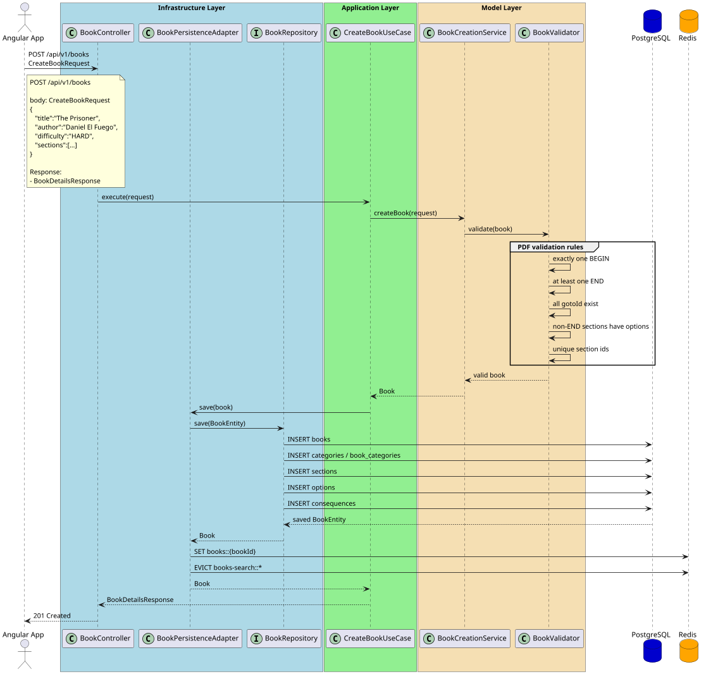
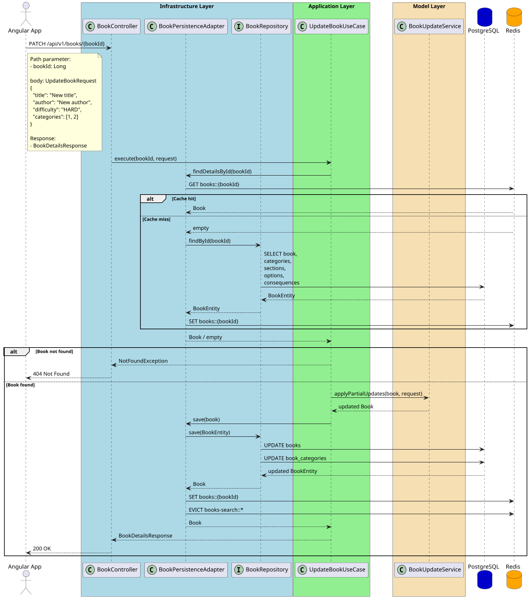
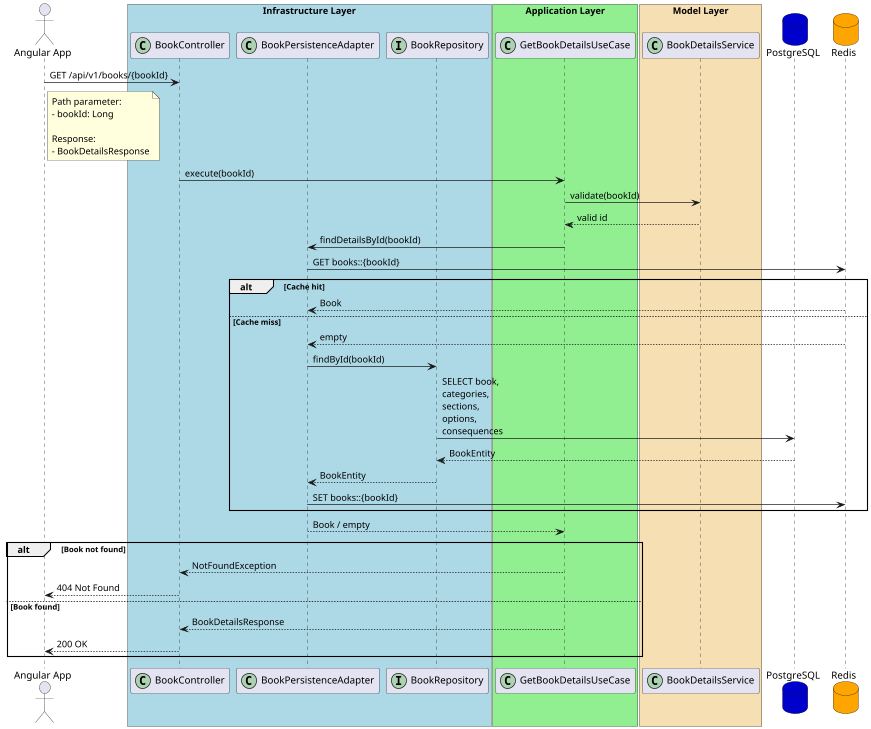
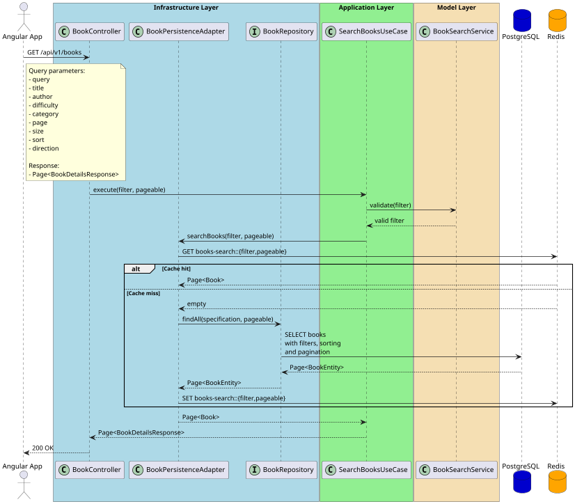
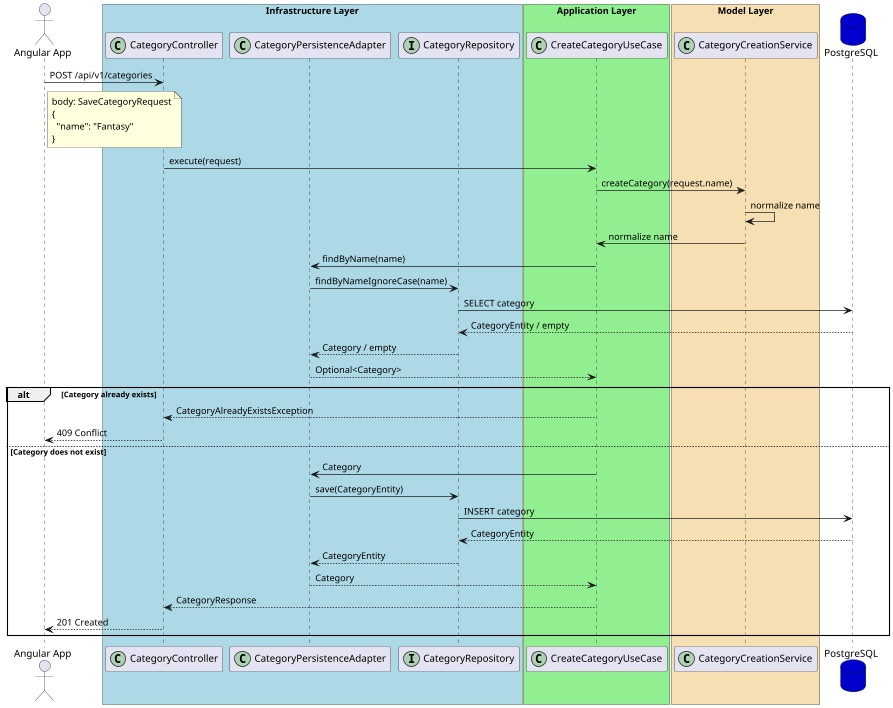
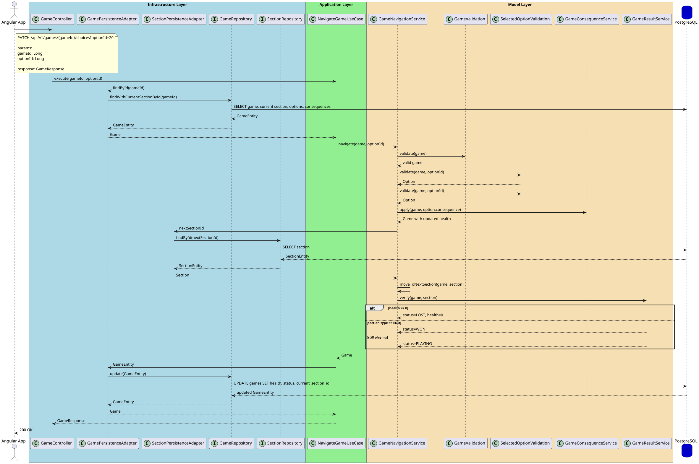
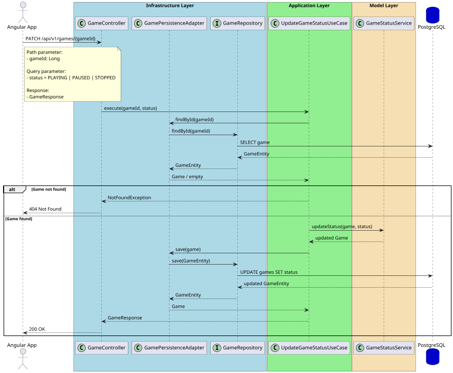
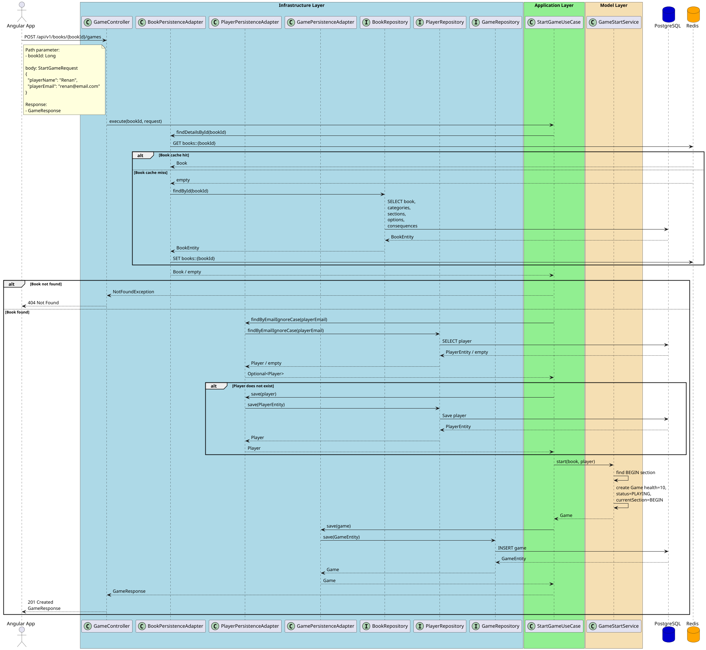
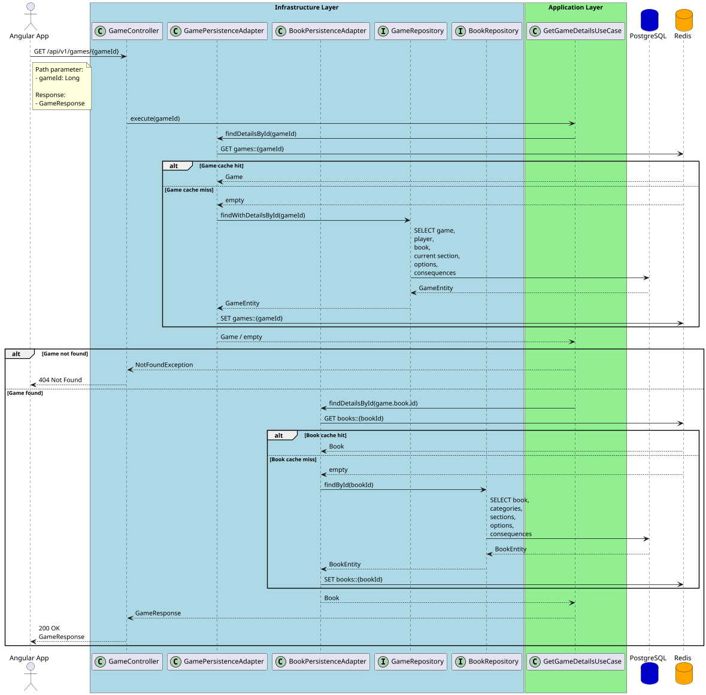

# Adventure-Library

<details>
  <summary><strong><span style="font-size: 1.1em;">
    💼 Challenge Overview
  </span></strong></summary>

###### Goal

Develop an interactive **Adventure Book** application using **Angular** for the frontend and **Java with Spring Boot** for the backend. The application should allow players to navigate through interactive books where each decision leads to a different section of the story. :contentReference[oaicite:0]{index=0}

---

###### Scenario

Adventure books immerse the reader in a branching story composed of numbered sections. At the end of each section, the player chooses an option that determines the next section to read. The journey continues until the player reaches an ending or dies. :contentReference[oaicite:1]{index=1}

The application must allow users to:

- Browse available books
- Search and filter books
- Start and play an adventure
- Navigate between sections
- Handle game consequences (health, death, victory)
- Save and resume game progress (extra feature)

---

###### Book Validation Rules

A book is considered **invalid** if any of the following conditions are met:

- It contains no **BEGIN** section or more than one **BEGIN** section.
- It contains no **END** section.
- Any option references an invalid next section.
- Any non-ending section contains no navigation options.

---

###### Gameplay Rules

- Every player starts with 10 Health Points (HP).
- Choosing an option may trigger a consequence.
- Consequences can increase or decrease HP.
- If HP reaches 0, the player dies.
- The game ends when:
    - the player reaches an END section, or
    - the player's HP reaches 0.

---

###### Frontend Objectives (Angular)

###### Core Features

- Browse, list and search books by title, author, category and difficulty.
- View detailed book information, including categories.
- Add and remove book categories.
- Start and navigate through interactive adventure books.
- Apply gameplay consequences and manage the player's health system.
- Display the current book title and player health during gameplay.
- Allow players to choose among the available options to progress through the story.
- Pause, stop and save game progression.

###### Extra Features

- Improve UI/UX with responsive layout, animations and progression indicators.
- Save and resume game progress through backend persistence.
- Support multiple players, each with their own independent game progress.
- Add new adventure books to the frontend library.

---

###### Technical Notes

- Objectives should be implemented in the specified order.
- Extra objectives are evaluated only after the mandatory requirements are completed.
- AI-assisted development is allowed, provided its usage is documented in the project README, including prompts and the parts implemented manually.

---

</details>

<details>
  <summary><strong><span style="font-size: 1.1em;">
    🌐 Swagger UI
  </span></strong></summary>

###### Local Swagger Access
```text
http://localhost:9090/swagger-ui/index.html
```

###### RESTful APIs exposed through Swagger UI
```text
* GET   /api/v1/books?query=&title=&author=&difficulty=&category=&page=0&size=10&sort=title&direction=asc
* GET   /api/v1/books/{bookId}
* PATCH /api/v1/books/{bookId}
* POST  /api/v1/books

* POST  /api/v1/categories

* GET /api/v1/games/{gameId}
* PATCH /api/v1/games/{gameId}?status=PAUSED
* PATCH /api/v1/games/{gameId}/choices?optionId=20
* POST /api/v1/games/{gameId}/games
```
</details>


<details>
  <summary><strong><span style="font-size: 1.1em;">
    ⚙️ Setup Essentials
  </span></strong></summary>

###### Tools
- *Git*
- *Docker 24 +*
- *Docker Compose*
</details>

<details>
  <summary><strong><span style="font-size: 1.1em;">
    ▶️ How to Run
  </span></strong></summary>

###### Commands
```bash
git clone https://github.com/rhribeiro25/Adventure-Library-Web.git
```
```bash
cd Adventure-Library-Web
```
```bash
docker compose up --build
```
```text
http://localhost:4200
```
</details>

<details>
  <summary><strong><span style="font-size: 1.1em;">
    🧩 Sequence Diagrams
  </span></strong></summary>

###### Create Book – Success


---
###### Update Book – Success


---
###### Get Book Details – Success


---
###### Search Book – Success


---
###### Create Category – Success


---
###### Game Navigate – Success


---
###### Update Game – Success


---
---
###### Start Game – Success


---

###### Get Game Details – Success


---
</details>


#

